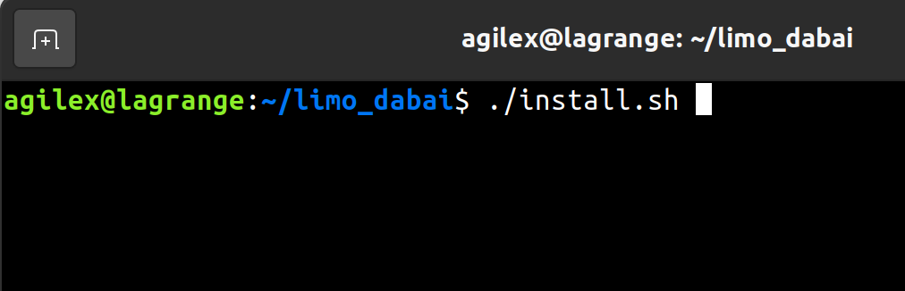
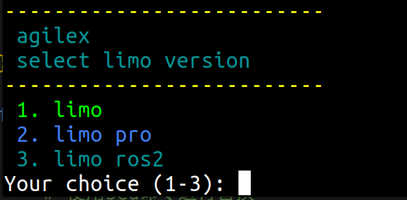

## 1. 拷贝解压
将压缩包拷贝到主目录并解压，进入解压文件夹并在其中打开终端

## 2. 运行脚本

``` bash
./install.sh
```


运行后出现选项：



根据车型号输入数字并按回车，脚本开始自动运行，例如limo ros2 上输入“3”并回车

如果需要输入密码，输入agx并确认

如果出现错误，可以尝试再运行一次

## 3. 验证

**limo:**

新建终端

``` bash
roslaunch astra_camera dabai_u3.launch
```

**limo pro:**

新建终端，输入1，回车

``` bash
roslaunch astra_camera dabai_u3.launch
```

新建终端，输入2，回车

``` bash
ros2 launch astra_camera dabai.launch.py
```

**limo ros2:**

新建终端

``` bash
ros2 launch astra_camera dabai.launch.py
```

